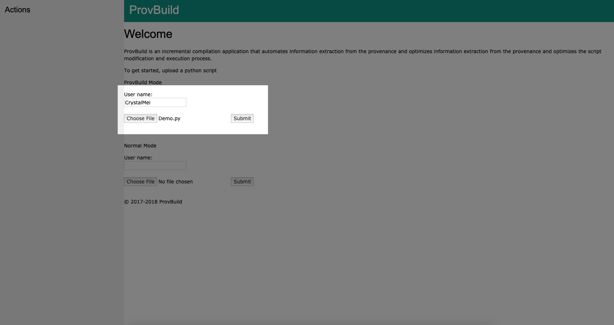
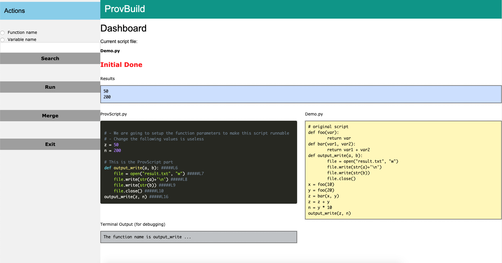
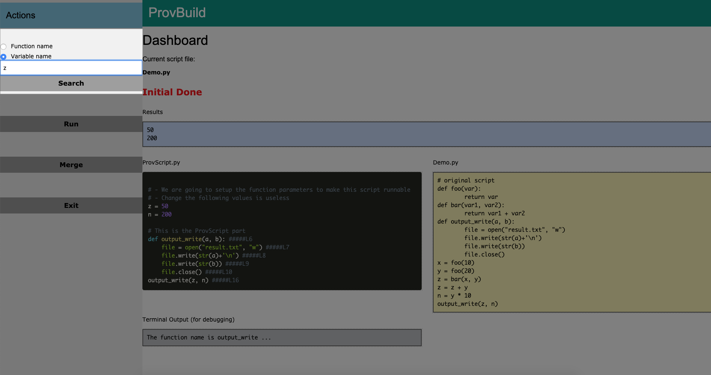
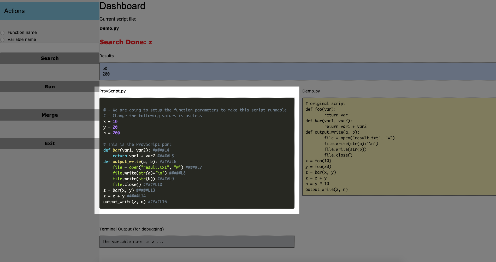
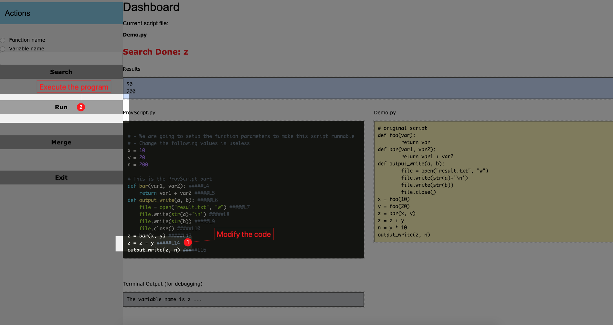
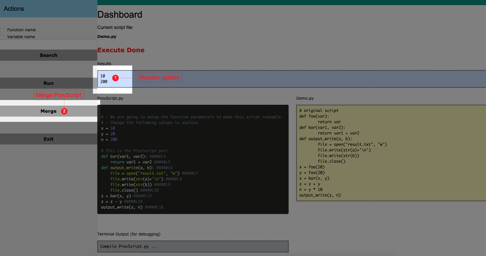
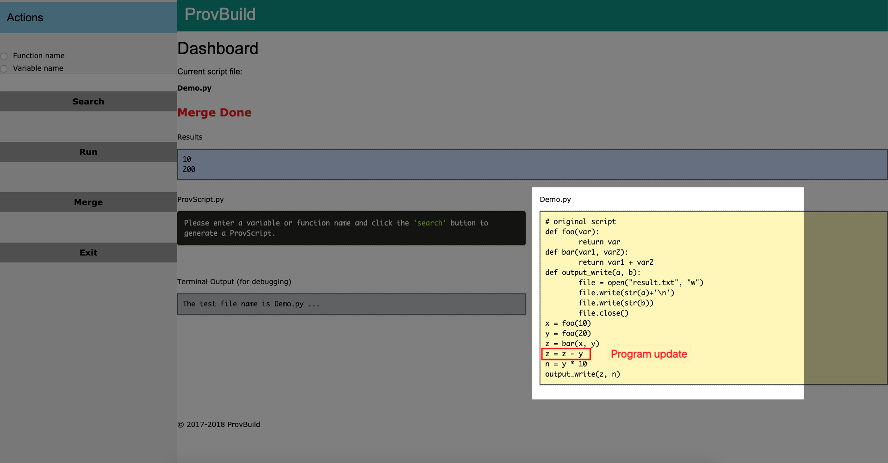

# ProvBuild

This is the artifact is for the paper: "Improving Data Scientist Efficiency with Provenance".

## Artifact Description

This artifact contains:

* A prototype tool of ProvBuild
	* Source code is available [here](https://github.com/CrystalMei/ProvBuild), no hidden links and access password.
* Documentation about ProvBuild installation and how to interact with ProvBuild.

## Documentation

### About ProvBuild
ProvBuild is a data analysis environment that uses change impact analysis to improve the iterative editing process in script-based workflow pipelines by harnessing a script’s provenance.

ProvBuild obtains provenance using noWorkflow, a Python-based provenance capture tool. Using the provenance information, ProvBuild identifies dependencies between inputs, program statements, functions, variables, and outputs, allowing it to precisely identify the sections of a script that must be re-executed to correctly update results after a modification. ProvBuild then generates a customized script, the _ProvScript_, that contains only those sections affected by a modification.

### Tool

ProvBuild is built on top of noWorkflow (Version 1.11.2). Check out [noWorkflow's Github](https://github.com/gems-uff/noworkflow) for more information details.

### Prerequisites
This version of ProvBuild only support **Python 2.7**.

To install ProvBuild, you should follow these basic instructions:

If you have python `pip`, install the following packages:

	$ pip install flask
	$ pip install sqlalchemy
	$ pip install pyposast
	$ pip install future
	$ pip install apted

### Clone the Repository

	$ git clone https://github.com/CrystalMei/ProvBuild.git
	$ cd ProvBuild

### ProvBuild Interface and Demo
- Step 1: The user runs `python app.py` and it will start a webpage as shown below:

- Step 2: The user selects ProvBuild mode and upload demo script `./example/Demo.py`:

- Step 3: After script submission, the webpage will be updated:

- Step 4: The user inputs the name of the function or variable (e.g. variable `z` in `Demo.py`) to edit:

- Step 5: After click **Search**, ProvBuild extracts the object's dependencies based on the stored provenance information and generates a _ProvScript_ containing only code pertaining to the chosen object. The webpage will be updated:

- Step 6: The user directly makes modifications on the _ProvScript_ (shown as {1}). After click **Run**, instead of running the original `Demo.py`, ProvBuild executes the shortened _ProvScript_ for the user (shown as {2}):

- Step 7:  The program results will be updated (shown as {1}). After click **Merge**, the user seasily merge edits from the _ProvScript_ into the original `Demo.py` (shown as {2}):

- Step 8: The original file will be updated with the user's modification:

## Github Link
[https://github.com/CrystalMei/ProvBuild](https://github.com/CrystalMei/ProvBuild)
